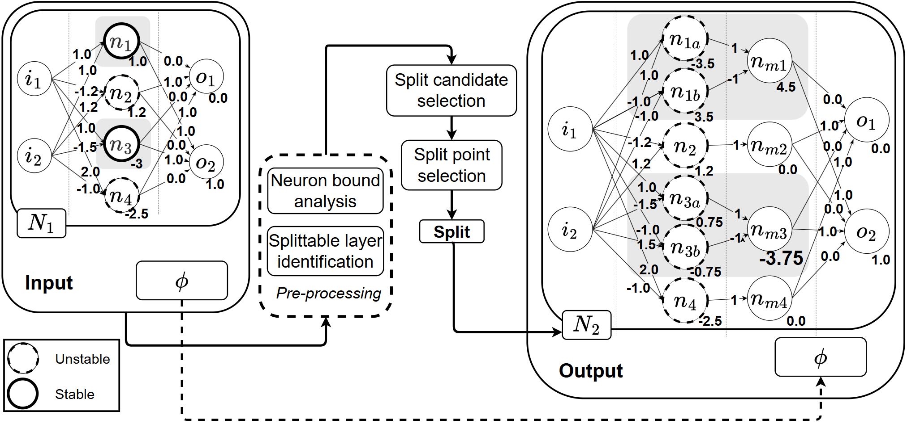

# ReluSplitter

ReluSplitter is a DNN verification(DNNV) benchmark generation tool for ReLU-based network. It takes input as a DNNV instance (network + property) and generates a modified network s.t. the modified network carries the same semantic of the orginal network, but it is harder to verify the property on the modified network. ReluSplitter achieves this by systematically de-stablizing stable neurons in the network. 




## Features
Currently, our tool accepts input in the standard `onnx` and `vnnlib` format, and
supports two common layer types.
- Fully-connected layer with ReLU activation
- Convolutional layer with ReLU activation

Technically, any network with above layers can be splitted. However, you might encounter compatibility issues due to factors like ONNX version differences or complex network structures. If you believe your input should work but doesn't, feel free to [open an issue](#) or contact us.


### Why ReluSplitter?

- ✅ **Semantic-preserving**: The generated network always retains the same semantics as the original. For example, if the original instance is `UNSAT`, the modified instance will also be `UNSAT`.  
- ⚡ **Fast generation**: A new DNNV instance can be created within seconds—significantly faster than alternative benchmark generation approaches that require training or distillation.


## Installation
- install `ReluSplitter`
```bash
./scripts/install.sh
```

## Usage
**Important:** Before running any commend below, first run `source rdy.sh` to activate the enviroment.


basic usage
- info
    ```bash
    python main.py info --net data/mnist_fc/onnx/mnist-net_256x6.onnx  --spec  data/mnist_fc/vnnlib/prop_5_0.03.vnnlib
    ```
- split
    ```bash
    python main.py split --net data/mnist_fc/onnx/mnist-net_256x6.onnx  --spec  data/mnist_fc/vnnlib/prop_5_0.03.vnnlib  --output split.onnx
    ```
    Output:
    ```bash
    /home/rsplitter/storage/relusplitter/libs/onnx2pytorch/convert/model.py:180: TracerWarning: Converting a tensor to a Python boolean might cause the trace to be incorrect. We cant record the data flow of Python values, so this value will be treated as a constant in the future. This means that the trace might not generalize to other inputs!
    if not self.experimental and inputs[0].shape[self.batch_dim] > 1:
    2025-06-15 18:45:35,878 - relu_splitter.utils.logger - INFO - fc_split.py:64 - ============= Split Mask Sumamry =============
    2025-06-15 18:45:35,878 - relu_splitter.utils.logger - INFO - fc_split.py:65 - stable+: 11      stable-: 202
    2025-06-15 18:45:35,878 - relu_splitter.utils.logger - INFO - fc_split.py:67 - unstable: 43     all: 256
    2025-06-15 18:45:35,878 - relu_splitter.utils.logger - INFO - fc_split.py:85 - Selecting 11/11 stable+ ReLUs to split
    /storage/lli/relusplitter/relu_splitter/model/__init__.py:195: UserWarning: The given NumPy array is not writable, and PyTorch does not support non-writable tensors. This means writing to this tensor will result in undefined behavior. You may want to copy the array to protect its data or make it writable before converting it to a tensor. This type of warning will be suppressed for the rest of this program. (Triggered internally at ../torch/csrc/utils/tensor_numpy.cpp:206.)
    w = torch.from_numpy( numpy_helper.to_array(self._initializers_mapping[w]) )
    Constructing new layers: 100%|███████████████████████████████████████████████████████████████████████████████████████████████████████████████████████████████████████████████████████████████████████████████████| 256/256 [00:00<00:00, 77042.54it/s]
    2025-06-15 18:45:35,909 - relu_splitter.utils.logger - INFO - main.py:150 - Split model saved to split.onnx
    2025-06-15 18:45:35,909 - relu_splitter.utils.logger - INFO - main.py:173 - === Done ===
    ```

ReluSplitter also provide a number of parameters for users to explore. For example: the number of split, the type of layer, or the type of neuron to split (stably active, stably inactive, unstable). Run with `-h` flag to display avaliable options.


